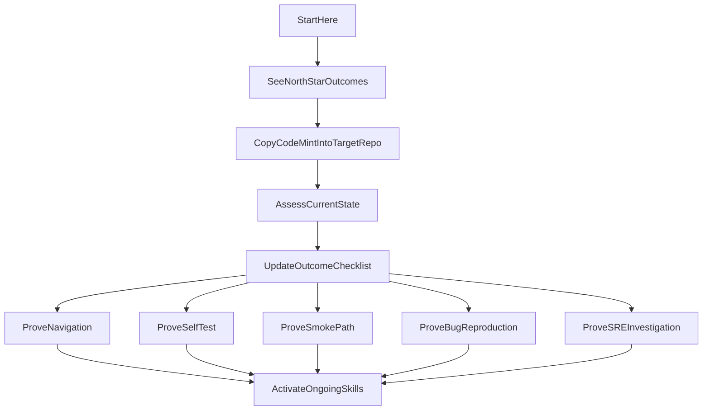

# Code-Mint

Code-mint is the **source repository** for harness-engineering documentation, skills, and templates. Teams use it to copy a small onboarding bundle into a target repository and turn that repository into one an AI agent can navigate, validate, smoke-test, and debug with evidence.

This repository is reference material, not an application. The actual onboarding work happens inside the target repository that adopts these assets. Do not try to build or run code-mint itself.

## Instructions To Use

Navigate to your target codebase, and tell an agent operating within that codebase:

```text
Use https://github.com/patterninc/code-mint as the canonical source for onboarding this repository for AI-first development. Follow its instructions, do not overwrite existing agent instructions blindly, start in assessment-first mode, keep `docs/onboarding-checklist.md` updated as the system of record, and stop for approval before remediation.
```

If you are applying it to a directory within a larger repository, also specify the onboarding scope:

```text
Onboarding scope: [path relative to repo root, for example `apps/my-service`]. Treat onboarding paths as relative to that directory, and also read the repo root `README.md` plus any `README.md` files along the path to that scope.
```

## Three pillars

Harness work here is organized around three ideas. The [six outcomes](#outcome-map) below are the concrete proof model.

1. **Legibility** — Can an AI agent navigate the codebase using durable in-repo guidance (`AGENTS.md`, maps, conventions)?
2. **Autonomy** — Can it self-verify with tests, safe runtime checks, and—where applicable—trusted access to operational tools and signals (not necessarily full production parity; see [`docs/framework.md`](docs/framework.md))?
3. **Clarity** — After the core outcomes are in place, can it collaborate on plans and tickets that are precise enough to execute (`clarity--ticket-writer`)?

## At A Glance

- Use code-mint when you want to onboard another repository for AI-first development.
- Copy from this repo into the target repo: portable skills under `.agents/skills/` and the core onboarding docs under `docs/`.
- Contribute here when you want to improve the shared workflows, templates, and guidance used across many target repos.

## What This Transformation Unlocks

By the end of onboarding, a well-configured target repository should prove six north-star outcomes (`Validate Current State` through `SRE Investigation`): baseline visibility, intentional navigation, targeted tests, a safe smoke path, deterministic bug repros, and evidence-backed operations where applicable.

The detailed definitions, proof criteria, and skill mapping live in [`docs/outcomes.md`](docs/outcomes.md). Track evidence in [`docs/onboarding-checklist.md`](docs/onboarding-checklist.md).

## Start Here

If you are new to code-mint, use the docs in this order:

- Start here: `README.md`
- Track progress here: `docs/onboarding-checklist.md`
- Go deeper on the workflow here: `docs/adoption-guide.md`
- Read the principles only when needed: `docs/framework.md`

## Onboarding Experience



## Quick Start

### 1. Choose the target scope

Code-mint can be applied to an entire repository or to one project inside a larger monorepo.

```bash
TARGET_REPO=/path/to/your-repo
TARGET_SCOPE=/path/to/your-repo # or /path/to/your-repo/apps/your-project
```

### 2. Copy code-mint into a temporary source directory inside the target repo

If the target repo already has `.agents/`, `AGENTS.md`, or another instruction system, inspect it first. Code-mint is meant to be merged deliberately, not dropped on top of existing guidance.

```bash
cd "$TARGET_REPO"
git checkout -b chore/code-mint-phase-1-assessment
git clone https://github.com/patterninc/code-mint.git .code-mint-source
mkdir -p "$TARGET_SCOPE/.agents/reports" "$TARGET_SCOPE/.agents/reports/completed" "$TARGET_SCOPE/docs"
cp -RL .code-mint-source/.agents/skills "$TARGET_SCOPE/.agents/"
cp .code-mint-source/docs/framework.md "$TARGET_SCOPE/docs/"
cp .code-mint-source/docs/outcomes.md "$TARGET_SCOPE/docs/"
cp .code-mint-source/docs/onboarding-checklist.md "$TARGET_SCOPE/docs/"
cp .code-mint-source/docs/skills-status.md "$TARGET_SCOPE/docs/"
touch "$TARGET_SCOPE/.agents/reports/.gitkeep" "$TARGET_SCOPE/.agents/reports/completed/.gitkeep"
```

The commands above copy the **minimal** onboarding bundle (skills plus core docs). Optional additions you can copy from the same source when needed include `docs/adoption-guide.md` and `docs/skill-development.md` (skill authoring for contributors).

`cp -RL` dereferences symlinks, which makes copies more robust in sandboxed environments.

Then update `"$TARGET_SCOPE/.gitignore"` so report directories stay in version control while generated reports stay local:

```gitignore
.agents/reports/*
!.agents/reports/.gitkeep
!.agents/reports/completed/
.agents/reports/completed/*
!.agents/reports/completed/.gitkeep
```

If you rely on a **single `.gitignore` at the git repository root** (common in monorepos) and `TARGET_SCOPE` is not the repository root, add the same patterns there with a path prefix (for example `apps/my-service/.agents/reports/*`) or add a `.gitignore` file under `TARGET_SCOPE` instead.

### 3. Tell the receiving agent what to do

Open the folder that matches `TARGET_SCOPE` in your editor when you can (so relative paths resolve the same way for you and the agent). If you stay at the git repository root, name the scope in the prompt. Example:

```text
Use the meta--onboarding skill to onboard this repository. Start by assessing the current state, keep docs/onboarding-checklist.md updated as the system of record, and wait for approval before making changes.
```

If onboarding only a subdirectory (when `TARGET_SCOPE` is not the repository root), add a line such as: `The onboarding scope is [path relative to repo root, e.g. apps/my-service]. Treat docs/, .agents/, and AGENTS.md paths as relative to that directory. Also read the git repository root README.md and any README.md files along the path from the repo root to that scope for repo-wide setup, deploy, CI, or environment notes that may not exist under the scope.`

### 4. Expect baseline evidence before remediation

The first milestone is not "make changes." It is "prove the current state."

Expected baseline artifacts:

- `.agents/reports/legibility--auditor-audit.md`
- `.agents/reports/autonomy--test-readiness-auditor-audit.md`
- `.agents/reports/autonomy--env-auditor-audit.md` when env loading applies
- `.agents/reports/autonomy--runtime-auditor-audit.md` when runtime applies
- `.agents/reports/autonomy--sre-auditor-audit.md` when cloud or monitoring applies
- `.agents/reports/onboarding-summary.md`
- `docs/onboarding-checklist.md` updated with current statuses and next proofs

### 5. Prove one outcome at a time

The recommended order is:

1. `Validate Current State`
2. `Navigate`
3. `Self-Test`
4. `Smoke Path`
5. `Bug Reproduction`
6. `SRE Investigation`

This keeps the work understandable and gives the user a visible sense of progress.

The `meta--onboarding` playbook sometimes groups related outcomes into one **phase** (for example Self-Test and Smoke Path, or Bug Reproduction and SRE Investigation) when the work naturally runs together. Treat that as scheduling convenience: in `docs/onboarding-checklist.md`, still record **one outcome at a time**—complete evidence for each outcome in the order above before leaning on the next.

When the copy is complete, you can remove the temporary source directory:

```bash
cd "$TARGET_REPO"
rm -rf .code-mint-source
```

## Outcome Map

Full definitions, proof criteria, primary skills, and proof artifacts are in [`docs/outcomes.md`](docs/outcomes.md). The six outcomes, in recommended order:

1. `Validate Current State`
2. `Navigate`
3. `Self-Test`
4. `Smoke Path`
5. `Bug Reproduction`
6. `SRE Investigation`

## Founding principles

The three pillars above are expanded in `docs/framework.md` with mechanical rules (progressive disclosure, proof loops, permission tiers, and dependency discipline).

## Repository Map

| Path | Purpose |
|---|---|
| `README.md` | Human-facing overview, quick start, and onboarding journey |
| `AGENTS.md` | Concise agent-facing instructions for working in this repository |
| `.agents/skills/` | Portable workflows that the receiving agent loads on demand |
| `.agents/rules/` | Short guidance on when to codify persistent project rules |
| `docs/outcomes.md` | The public north-star outcomes and evidence model |
| `docs/onboarding-checklist.md` | The canonical outcome tracker template |
| `docs/adoption-guide.md` | The detailed operator guide for onboarding a target repo |
| `docs/framework.md` | The conceptual foundation for harness engineering |
| `docs/skills-status.md` | Compatibility view that maps skills to outcomes |
| `docs/skill-development.md` | How to create and maintain skills |
| `.agents/skills/legibility--enhancer/references/` | Fill-in-the-blank `AGENTS.md` templates and authoring guide |

## Skill Categories

The skill IDs stay stable even though the public story is outcome-first:

| Category | Purpose |
|---|---|
| `meta--` | Onboarding and skill-library management |
| `legibility--` | Making the repo navigable and well-documented |
| `autonomy--` | Self-verification, runtime readiness, env setup, and operational tooling (including `autonomy--sre-*`) |
| `clarity--` | Collaborative planning and executable tickets after core onboarding |

## Governance

Treat agent instructions as code:

- keep the top-level onboarding story in `README.md`
- keep `AGENTS.md` agent-facing and concise
- update affected docs or skills when workflows or conventions change
- designate a Rule Steward or equivalent owner for reviewing instruction changes

**Canonical upstream:** the `patterninc/code-mint` repository is the source-of-truth for this library. Pull requests are welcome; reviews focus on clarity, accuracy, and alignment with the outcome-first model described in `CONTRIBUTING.md`. Response times depend on maintainer availability.

## Standards

This repository relies on two open, vendor-neutral standards:

- **[AGENTS.md](https://agents.md/)** for portable agent instructions
- **[SKILL.md](https://agentskills.io/home)** for portable agent workflows

No file in this repository requires a specific IDE, CLI, or AI platform to be useful.

## Contributing

See `CONTRIBUTING.md` for how to propose changes, conventions for skills and templates, and the review process.

## Security

To report a security-sensitive issue, see `SECURITY.md`.

## License

Code-mint is licensed under the Apache License 2.0. See `LICENSE` for the full text.
